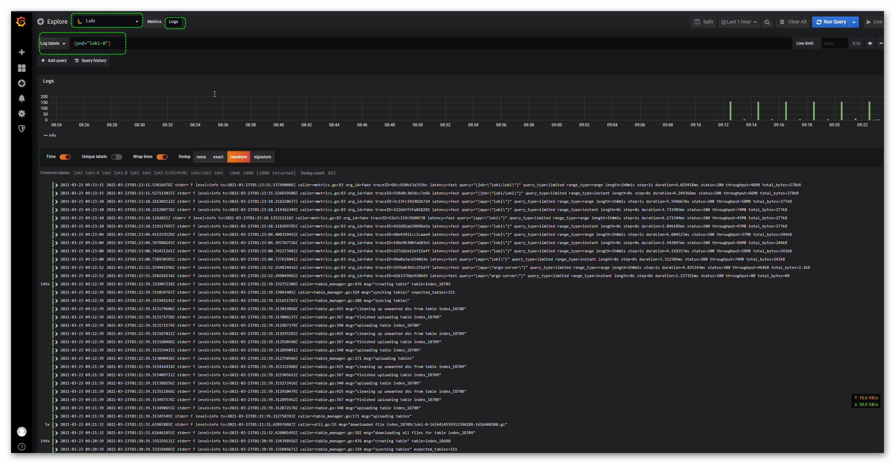

### 安装loki stack
```
helm repo add grafana https://grafana.github.io/helm-charts
helm repo update
```

```
helm search repo grafana
```

Deploy Loki Stack (Loki, Promtail, Grafana, Prometheus)

```
kubectl create ns <YOUR-NAMESPACE>

helm upgrade --install loki grafana/loki-stack --namespace=<YOUR-NAMESPACE> --set grafana.enabled=true,prometheus.enabled=true,prometheus.alertmanager.persistentVolume.enabled=false,prometheus.server.persistentVolume.enabled=false

---


```


To get the admin password for the Grafana pod, run the following command:
```
kubectl get secret --namespace <YOUR-NAMESPACE> loki-grafana -o jsonpath="{.data.admin-password}" | base64 --decode ; echo

---
 kubectl get secret --namespace loki loki-grafana -o jsonpath="{.data.admin-password}" | base64 --decode ; echo
bDPhr2JUAu4OMb2u8SxlnVrQmY7STby0inn7hYT4


```
To access the Grafana UI, run the following command:

```
kubectl port-forward --namespace <YOUR-NAMESPACE> service/loki-grafana 9000:80

---
kubectl port-forward --namespace loki --address=0.0.0.0 service/loki-grafana 9000:80
Forwarding from 0.0.0.0:9000 -> 9000
```

http://116.196.95.227:9000/login  输入用户 admin 密码 bDPhr2JUAu4OMb2u8SxlnVrQmY7STby0inn7hYT4登录grafana

### 添加数据源

Log into your Grafana instance. If this is your first time running Grafana, the username and password are both defaulted to admin.
In Grafana, go to Configuration > Data Sources via the cog icon on the left sidebar.
Click the big + Add data source button.
Choose Loki from the list.
The http URL field should be the address of your Loki server. For example, when running locally or with Docker using port mapping, the address is likely http://localhost:3100. When running with docker-compose or Kubernetes, the address is likely http://loki:3100.
To see the logs, click Explore on the sidebar, select the Loki datasource in the top-left dropdown, and then choose a log stream using the Log labels button.
Learn more about querying by reading about Loki’s query language LogQL.




### ref
>https://grafana.com/docs/loki/latest/installation/helm/
>https://grafana.com/docs/loki/latest/getting-started/grafana/
>https://www.qikqiak.com/post/grafana-loki-usage/
